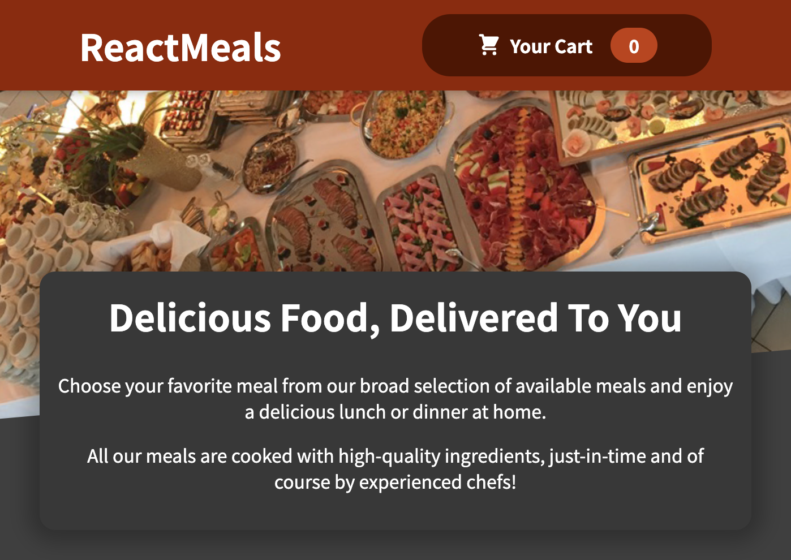

# Food Order App



A simple demonstration of an online order form for a restaurant.

## Description

This app was developed using React, and styled using CSS module. It performs various tasks solely using React's core features. 

## Getting Started

### Dependencies

* Node Package Manager
* React

### Installing

Download the app anywhere on your computer.

### Executing program

Use the commandline below in the location where the app is downloaded.
```
npm start
```

## Author

Jay Lee (GitHub: [jyl7094](https://github.com/jyl7094))
